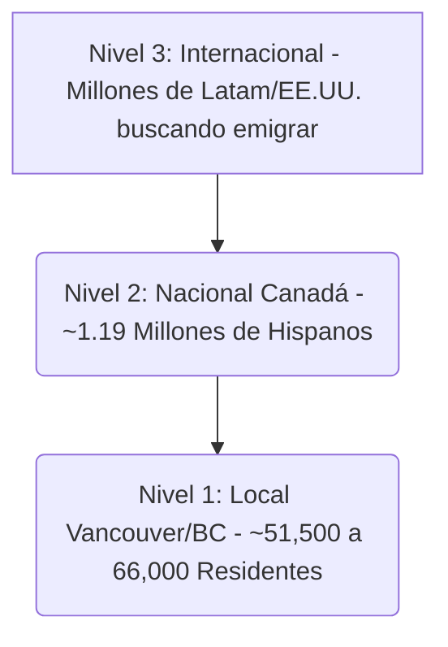

# ANÁLISIS DE MERCADO Y TAMAÑO DE AUDIENCIA OBJETIVO: CBN NOTICIAS
**Cliente:** José Augusto Marín (cbnnoticias@gmail.com)  
**Fecha:** 28 de Junio de 2026  
**Preparado por:** KASI (Kroma AI Systems Inc.)  
**Metodología:** Segmentación Demográfica Censal (Estadísticas de Canadá 2021) y Mapeo de Audiencia de Nicho.

---

## 1. DIMENSIONAMIENTO DEL MERCADO OBJETIVO (MARKET SIZING)

El mercado objetivo para **CBN Noticias** se divide en tres niveles geográficos y de intención de lectura, calculados a partir de los últimos datos del Censo de Canadá y retabulaciones comunitarias:

### Nivel 1: Mercado Local Caliente (Metro Vancouver y Columbia Británica)
* **BC Total (Censo 2021):** **~65,970 personas** autoidentificadas como latinoamericanas (un incremento del 49% con respecto a las 44,115 del censo anterior).
* **Metro Vancouver (78% de la provincia):** **~51,500 personas** de habla hispana residiendo en el Área Metropolitana de Vancouver.
* **Perfil de Consumo:** Es la audiencia más valiosa comercialmente. Buscan noticias viales, alertas de seguridad de Surrey, normas de arriendo locales en BC, y eventos culturales como el Carnaval del Sol. Es el foco principal para los anunciantes locales (restaurantes, realtors, escuelas locales).

### Nivel 2: Mercado Nacional (Canadá General)
* **Total Nacional (Ajustado CHC):** **~1,190,000 hispanohablantes** en todo el territorio canadiense (estimación combinada por lengua materna, lugar de nacimiento y origen étnico).
* **Perfil de Consumo:** Interés en noticias federales, cambios en leyes de inmigración generales, empleo en Canadá y política federal. Es el objetivo para grandes marcas y agencias de inmigración nacionales.

### Nivel 3: Mercado Internacional Inbound (Latinoamérica y Estados Unidos)
* **Audiencia Estimada:** Millones de personas en México, Colombia, Venezuela, y la población hispana en EE.UU. interesadas en migrar a Canadá.
* **Perfil de Consumo:** Consumen masivamente las secciones de **Inmigración y Trabajo de CBN**. Buscan guías, noticias de sorteos de Express Entry y oportunidades laborales en BC (BC PNP).

---

## 2. PENETRACIÓN DE MERCADO ACTUAL Y POTENCIAL DE CBN NOTICIAS

Al correlacionar el tráfico del portal actual con el tamaño de su audiencia real, identificamos la brecha de oportunidad (Market Share):

| Segmento de Mercado | Tamaño Total del Mercado (Target) | Tráfico Actual de CBN (~1,000 visitas/mes) | Cuota de Mercado Actual | **Tráfico Estimado Mes 12 (~27,600 visitas/mes)** | **Cuota de Mercado Proyectada (Mes 12)** |
| :--- | :---: | :---: | :---: | :---: | :---: |
| **Local (Vancouver/BC)** | ~66,000 | ~250 visitas/mes | 0.37% | ~8,000 visitas/mes | **12.12%** |
| **Nacional (Canadá)** | ~1.19 Millones | ~250 visitas/mes | 0.02% | ~8,000 visitas/mes | **0.67%** |
| **Internacional (Inbound)** | Millones | ~500 visitas/mes | < 0.01% | ~11,600 visitas/mes | **Niche Growth** |

### Conclusiones del Análisis de Mercado:
1. **La oportunidad local está virgen:** CBN Noticias apenas captura el 0.37% de la población hispana local de BC debido a que su portal actual está roto para búsquedas móviles rápidas en Google.
2. **El bloqueo de Meta no es el fin:** Al migrar a Astro y enfocarse en SEO orgánico recuperando las 1,100 notas históricas, CBN puede capturar fácilmente un 12% del mercado local de Vancouver (~8,000 visitas/mes) y un flujo constante de tráfico internacional, logrando estabilizar las 27,600 visitas totales sin depender de redes sociales.
