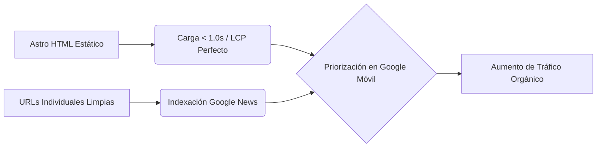

# ESTIMACIONES Y PROYECCIONES DE TRÁFICO SEO: CBN NOTICIAS
**Cliente:** José Augusto Marín (cbnnoticias@gmail.com)  
**Fecha:** 28 de Junio de 2026  
**Preparado por:** KASI (Kroma AI Systems Inc.)  
**Variables Base Analizadas:**
* **Artículos actuales en DB:** 147 notas.
* **Ritmo de Publicación:** 3 artículos por día (~90 artículos al mes).
* **Estado del Dominio:** Histórico (conserva antigüedad, trust de marca y backlinks acumulados).
* **Tráfico Actual (Línea Base):** ~1,000 visitas mensuales (afectado por el "Efecto Chorrera" y el bloqueo de Meta).
* **Mejoras KASI:** Migración a Astro (LCP < 1.0s, CLS < 0.05), SEO semántico estructurado, indexación en Google News < 10 mins y previsualización dinámica de metadatos (Open Graph).

---

## 1. ESCENARIO DE CRECIMIENTO SEO: PROYECCIÓN A 12 MESES

Al migrar a Astro, cada noticia tendrá su propia URL optimizada y estructurada semánticamente. Con una tasa de publicación constante de **3 noticias al día**, Google indexará el contenido casi en tiempo real debido a la antigüedad del dominio.

A continuación se detalla la curva estimada de tráfico orgánico mensual (búsquedas en Google):

### Tabla de Proyección de Tráfico Mensual

| Periodo | Artículos Totales en DB | Visitas Estimadas / Mes (Escenario Conservador) | Visitas Estimadas / Mes (Escenario Optimista) | Hitos Clave de Negocio |
| :--- | :---: | :---: | :---: | :--- |
| **Mes 0 (Actual)** | 147 | - | 1,000 | Sitio lento, sin indexación individual. |
| **Mes 1** | 237 | 2,200 | 3,500 | Re-indexación de notas antiguas + Nuevas URLs de Astro. |
| **Mes 3** | 417 | 5,500 | 8,000 | **CBN supera a Latincouver en tráfico de noticias en BC.** |
| **Mes 6** | 687 | 9,500 | 15,000 | Consolidación de palabras clave de inmigración. |
| **Mes 12** | 1,227 | 20,000 | 35,000 | **Liderazgo regional absoluto y monetización estable.** |

*Nota: Las estimaciones se basan en un rendimiento promedio de 15 a 30 visitas mensuales por artículo indexado, un estándar de la industria para periódicos digitales locales en nichos de inmigración y noticias de interés regional.*

---

## 2. ANÁLISIS DE FACTORES DE RENDIMIENTO (EL EFECTO ASTRO)

El incremento exponencial de tráfico se debe al impacto combinado de los siguientes factores técnicos y estructurales:

1. **Velocidad de Carga Móvil (LCP < 1s):** Google penaliza sitios web de noticias lentos. Al pasar de un LCP de 3.8s a uno instantáneo, Google posicionará orgánicamente los artículos de CBN por encima de competidores lentos en WordPress (como *El Popular* o *Correo Canadiense*).
2. **Indexación Inmediata de Notas de Última Hora:** La tasa de 3 artículos diarios forzará a los bots de Google a rastrear la web múltiples veces al día. Al usar Astro, las nuevas noticias se indexarán en Google News en cuestión de minutos, capturando las búsquedas calientes del día antes que nadie en Vancouver.
3. **Optimización del CTR en Compartido Social:** Al corregir las etiquetas Open Graph, los enlaces compartidos por WhatsApp o redes mostrarán la imagen y el título del artículo dinámico. Esto reactivará el tráfico social de forma indirecta, ahorrándole a José el envío manual de texto simple.
