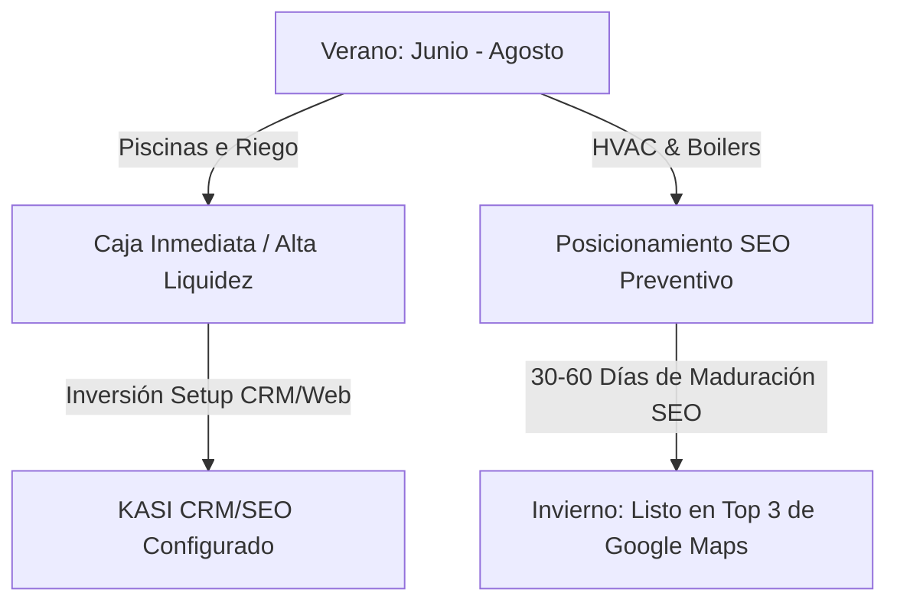

# PLAYBOOK DE PROSPECCIÓN: CONTRATISTAS DE PISCINAS, PLOMERÍA Y CALEFACCIÓN (HVAC)
**Temporada Actual:** Verano (Junio 2026)  
**Preparado por:** KASI (Kroma AI Systems Inc.)  
**Metodología:** Sandler Sales System (Prospección Estacional y Dolor de Visibilidad Orgánica)

---

## 1. LA ESTRATEGIA ESTACIONAL (DUNA)

La estacionalidad en British Columbia define el gancho comercial perfecto para KASI:

### A. Verano (Hoy): El Momento de las Piscinas, Riego y A/C
*   **El Nicho:** Contratistas de seguridad de piscinas, fontanería de albercas, sistemas de irrigación y aire acondicionado.
*   **La Oportunidad:** Están recibiendo un **flujo de caja máximo** debido al pico de la temporada de calor en BC. Tienen la liquidez para pagar de inmediato proyectos de setup de CRM, automatizaciones de cotización rápida y rediseño web.
*   **Gancho KASI:** *"Acelera tu despacho y captura de cotizaciones en ruta para que no pierdas ningún cliente en este pico de verano."*

### B. Invierno (Prevención): El Gancho para Calefacción (HVAC & Boilers)
*   **El Nicho:** Contratistas de reparación de hornos (furnaces), boilers (calentadores de agua comerciales/residenciales) y bombas de calor (heat pumps).
*   **La Oportunidad:** El invierno en Vancouver es implacable y las emergencias de calefacción se disparan a partir de octubre. 
*   **La Estrategia de Venta (Sandler Pain Projection):** El SEO local en Google Maps toma de **45 a 60 días para madurar**. Si un plomero de calefacción espera a que llegue el frío para optimizar su web, ya habrá perdido el negocio de emergencias frente a sus competidores. **Tienen que invertir en SEO en julio y agosto para estar en el Top 3 cuando caiga la primera nieve.**
*   **Gancho KASI:** *"Posicionamos tu empresa de calefacción en el Top 3 de Google Maps durante el verano para que seas el primer número que marquen cuando comiencen las fallas de calefacción en invierno."*

---

## 2. PLAYBOOK DE PROSPECCIÓN PASO A PASO

### **Paso 1: Mapeo de Candidatos en BC (Lunes/Martes)**
Buscaremos 10 empresas locales medianas en la zona de Vancouver, Burnaby, Coquitlam y Port Coquitlam bajo dos perfiles:
1.  **Perfil Verano (Caja Inmediata):** Compañías de *Pool plumbing/maintenance* y *Irrigation systems*.
2.  **Perfil Invierno (Preventivo):** Compañías familiares de *Heating, Furnaces & Boiler services*.
*   *Filtro de Descarte:* Sitios web que carguen lento, que no tengan botón directo de llamada móvil o que tengan bajas reseñas en Google Maps (menos de 30 reseñas).

### **Paso 2: La Auditoría SEO Local y Fuga de Leads**
Para cada candidato, KASI evaluará:
1.  **Posicionamiento en Google Maps:** ¿En qué página de Maps aparece para su palabra clave core? (Si está en página 2+, es prospecto caliente).
2.  **Falta de Review Funnel:** ¿Tienen un sistema automatizado para capturar estrellas en Google Maps?
3.  **Fuga de Conversión:** ¿Su sitio web móvil tarde más de 3 segundos en mostrar el botón de llamada directa?

### **Paso 3: El Mensaje de Abordaje Sandler (WhatsApp)**

#### **Para Contratistas de Calefacción/Boilers (Gancho Preventivo):**
> *"Hola [Nombre del Dueño], un saludo. Trabajo en optimización de SEO local para contratistas en BC. Notamos que tu empresa de calefacción aparece en la página 2 de Google Maps para búsquedas de Boilers en Burnaby. El SEO local tarda 60 días en dar resultados. Si optimizamos tu posicionamiento orgánico en Maps hoy durante el verano, estarás en el Top 3 en octubre cuando inicien las llamadas de emergencia por frío, ahorrándote miles de dólares en anuncios de Google. Diseñamos un prototipo rápido de optimización de mapa para tu zona. Si quieres ver cómo funciona, coordinamos 10 minutos esta semana. Si no, no hay problema. Un saludo."*

#### **Para Contratistas de Piscinas (Gancho de Agilidad):**
> *"Hola [Nombre del Dueño], un saludo. Diseñamos el CRM y SEO local de bcpoolsafety.com aquí en la provincia. Sabemos que estás en el pico de la temporada de verano y que cada llamada de cotización que no se responde rápido es dinero que va al competidor. Implementamos un sistema de cotización rápida por SMS y captura de reseñas automatizada para Google Maps. Si te interesa ver cómo automatizar tus cotizaciones en ruta para aprovechar el flujo de verano, me avisas y lo revisamos en 10 minutos. Si no, no hay ningún problema. Éxito con la temporada."*
